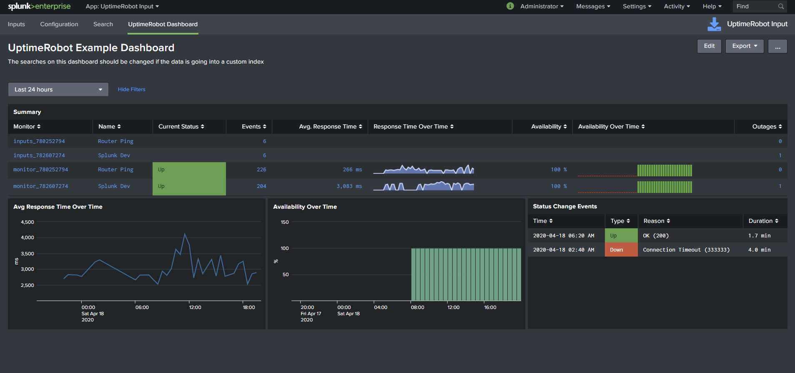

This modular input can retrieve data from [UptimeRobot](https://uptimerobot.com/). The API is a little strange and therefore there are three different types of events that will be ingested into Splunk. An example dashboard has been provided that shows how the data can be used.

In UptimeRobot, navigate to `My Settings` and click the button to create a "Read Only API key". API documentation is available here: https://uptimerobot.com/api  

[Splunkbase](https://splunkbase.splunk.com/app/4967/#/details) | [Source code](https://github.com/ChrisYounger/TA-uptimerobot-input) |  [Questions, Bugs or Suggestions](https://answers.splunk.com/app/questions/4967.html) | [My Splunk apps](https://splunkbase.splunk.com/apps/#/author/chrisyoungerjds)

